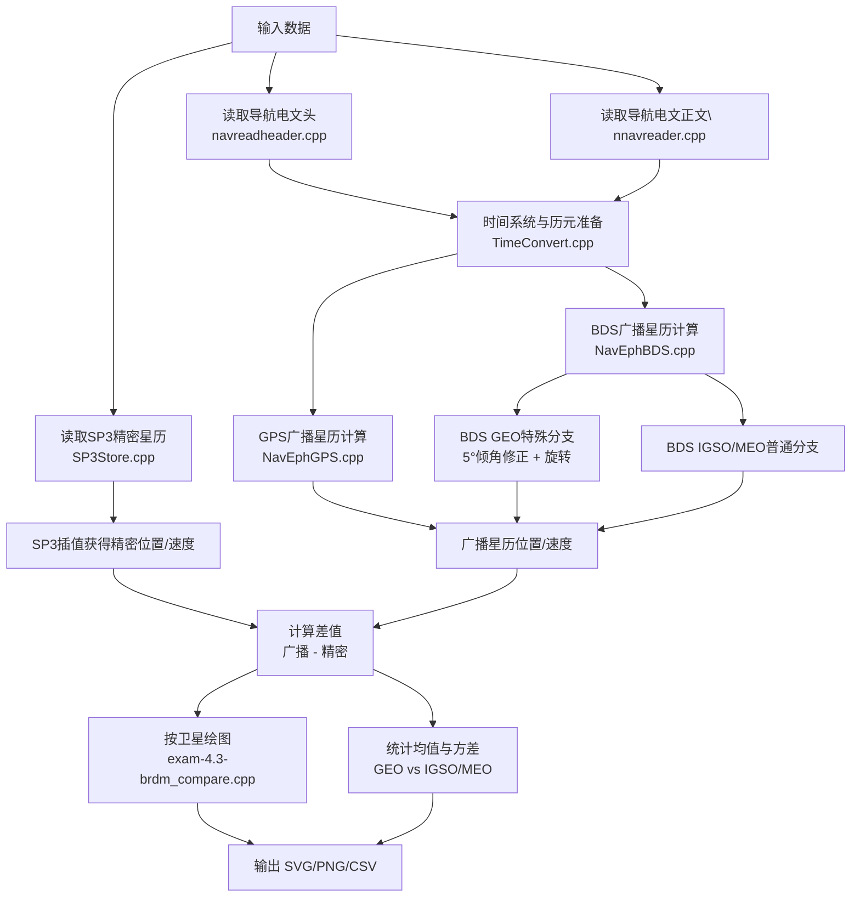

```mermaid
graph TD
    A["输入数据"] --> B["读取导航电文头\nnavreadheader.cpp"]
    A --> C["读取导航电文正文\  nnavreader.cpp"]
    A --> D["读取SP3精密星历\nSP3Store.cpp"]

    B --> E["时间系统与历元准备\nTimeConvert.cpp"]
    C --> E
    D --> F["SP3插值获得精密位置/速度"]

    E --> G["GPS广播星历计算\nNavEphGPS.cpp"]
    E --> H["BDS广播星历计算\nNavEphBDS.cpp"]

    H --> H1["BDS GEO特殊分支\n5°倾角修正 + 旋转"]
    H --> H2["BDS IGSO/MEO普通分支"]

    G --> I["广播星历位置/速度"]
    H1 --> I
    H2 --> I

    F --> J["计算差值\n广播 - 精密"]
    I --> J

    J --> K["按卫星绘图\nexam-4.3-brdm_compare.cpp"]
    J --> L["统计均值与方差\nGEO vs IGSO/MEO"]
    K --> M["输出 SVG/PNG/CSV"]
    L --> M

```